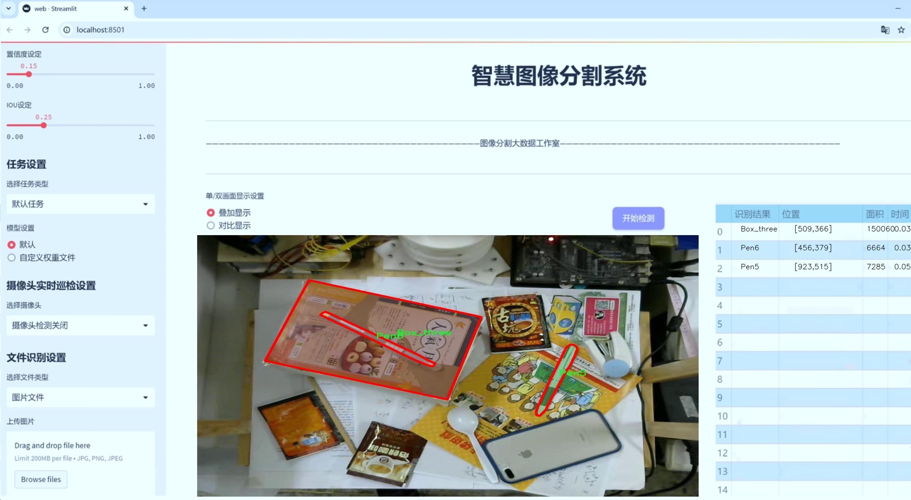
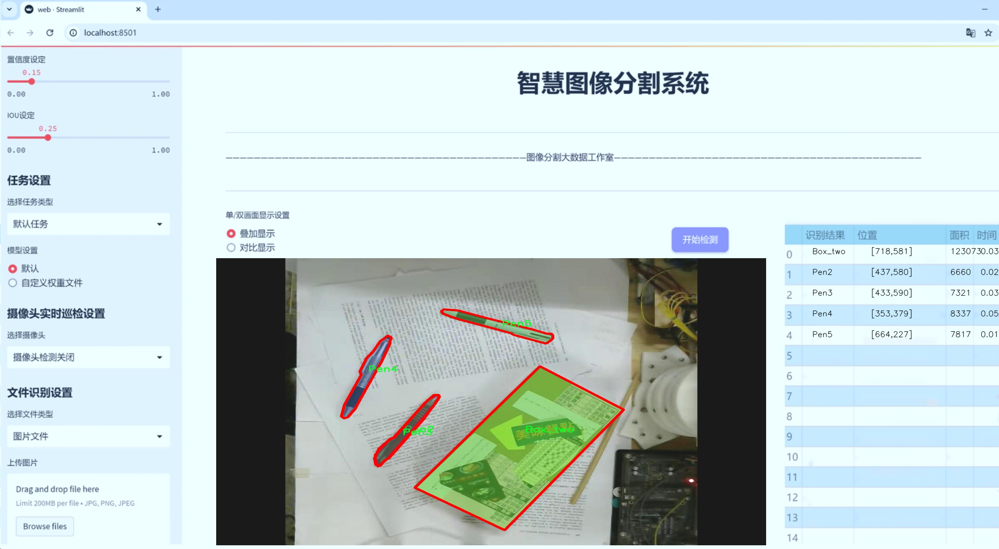
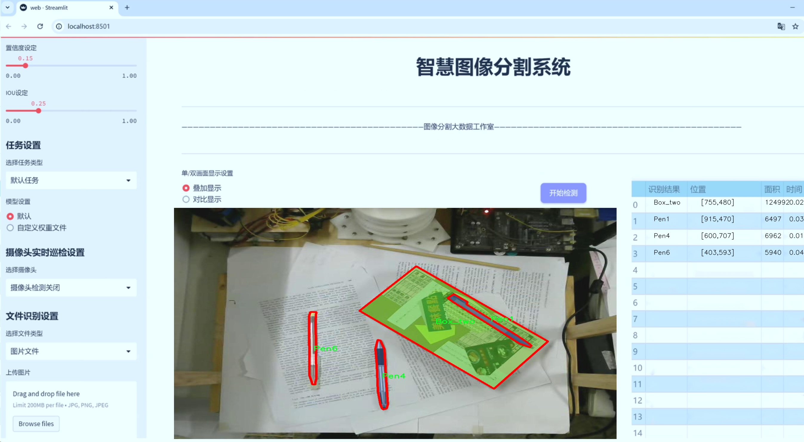
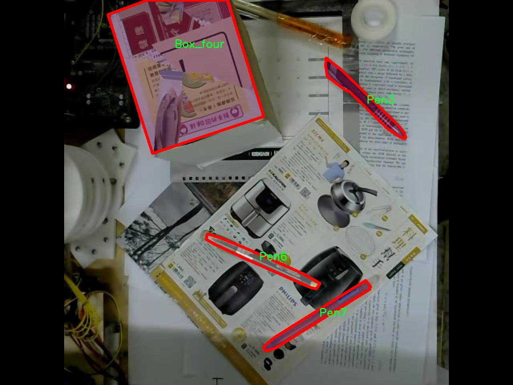
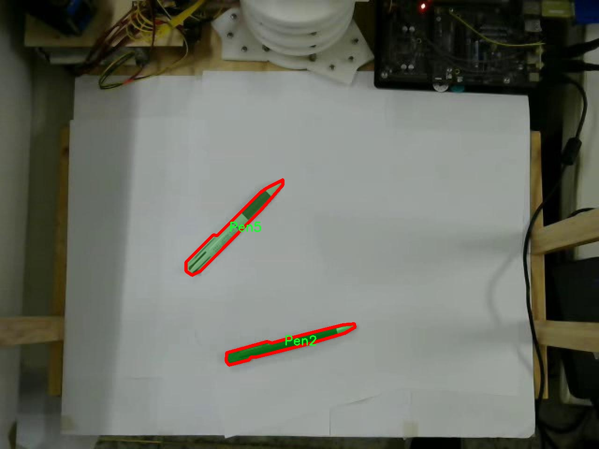
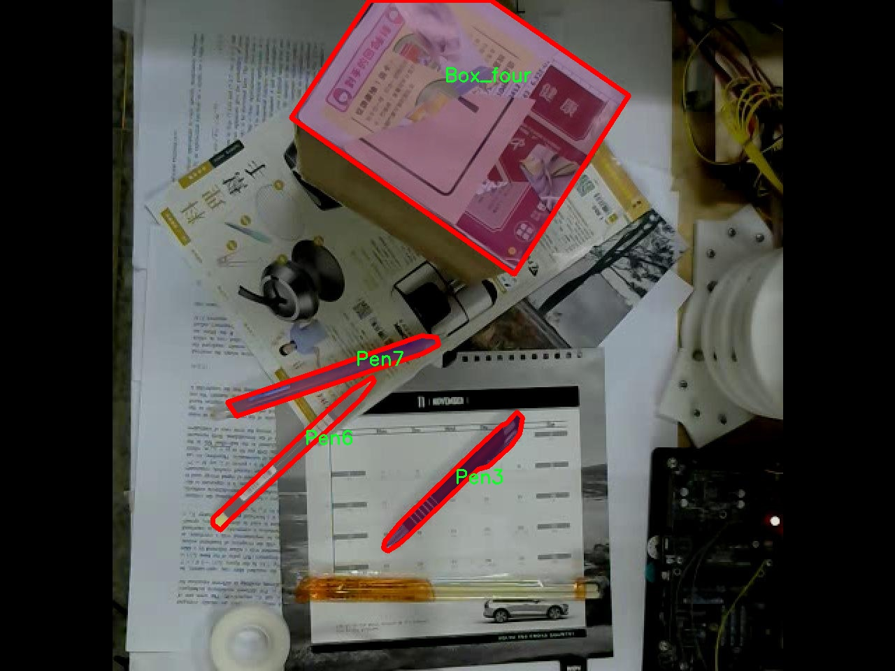
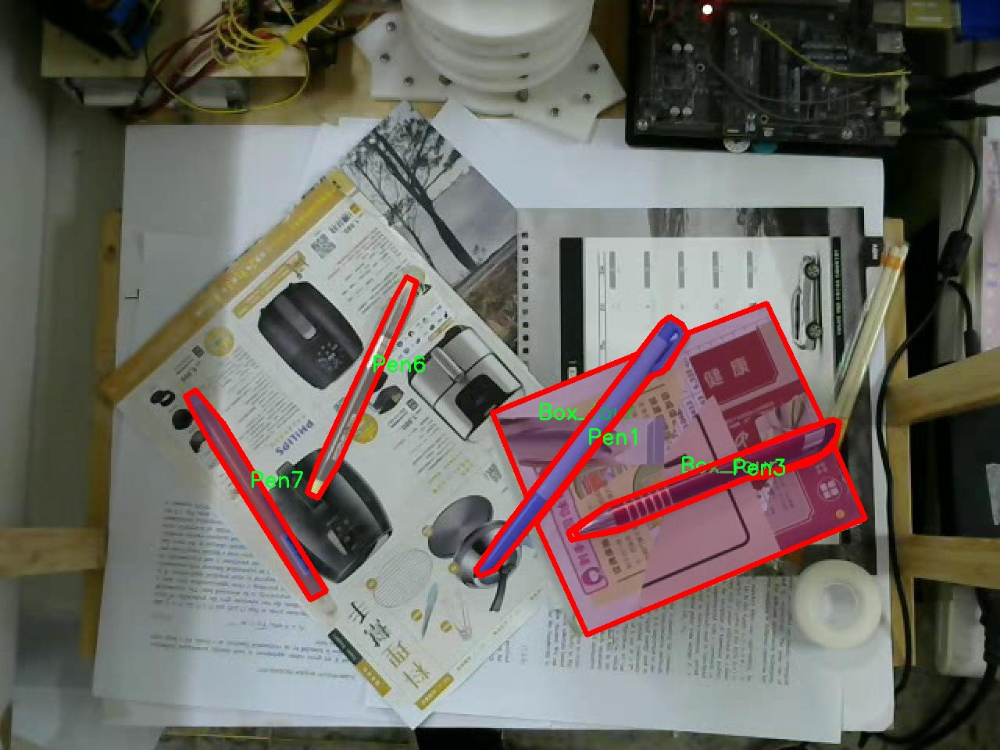
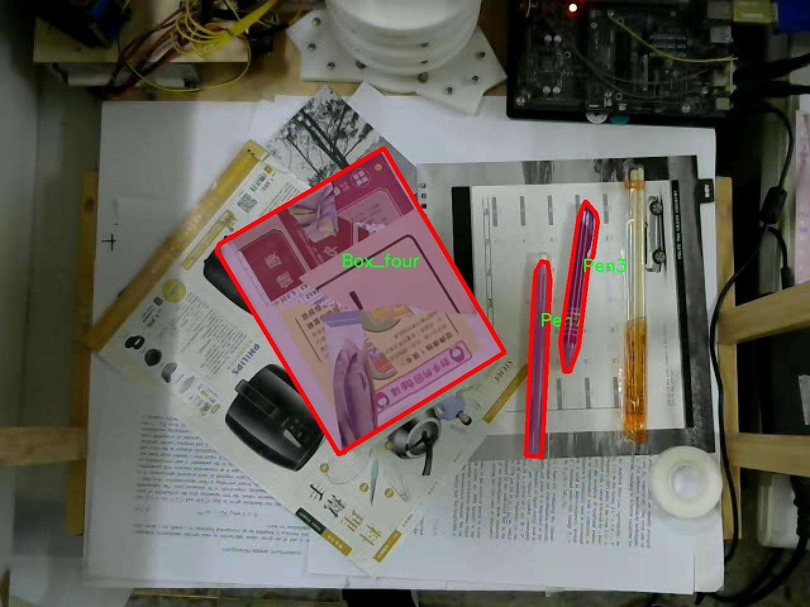

# 文具物品分割系统源码＆数据集分享
 [yolov8-seg-C2f-EMSC＆yolov8-seg-C2f-CloAtt等50+全套改进创新点发刊_一键训练教程_Web前端展示]

### 1.研究背景与意义

项目参考[ILSVRC ImageNet Large Scale Visual Recognition Challenge](https://gitee.com/YOLOv8_YOLOv11_Segmentation_Studio/projects)

项目来源[AAAI Global Al lnnovation Contest](https://kdocs.cn/l/cszuIiCKVNis)

研究背景与意义

随着人工智能技术的迅猛发展，计算机视觉领域在物体检测与分割方面取得了显著的进展。尤其是基于深度学习的目标检测算法，如YOLO（You Only Look Once）系列，因其高效性和实时性而受到广泛关注。YOLOv8作为该系列的最新版本，结合了更为先进的网络结构和训练策略，展现出在复杂场景下的优越性能。然而，尽管YOLOv8在通用物体检测任务中表现出色，但在特定领域的应用，如文具物品的分割，仍然面临诸多挑战。

文具物品的多样性和复杂性使得其分割任务具有一定的难度。以“Pen2”数据集为例，该数据集包含1900张图像，涵盖了12个类别的文具物品，包括不同类型的笔和盒子。这些物品在形状、颜色和纹理上各具特色，且在实际应用中可能存在重叠、遮挡等情况。因此，如何有效地利用YOLOv8进行文具物品的精确分割，成为了一个亟待解决的问题。

本研究旨在基于改进的YOLOv8模型，构建一个高效的文具物品分割系统。通过对YOLOv8的网络结构进行优化，结合数据集中的丰富信息，我们希望能够提升模型在文具物品分割任务中的准确性和鲁棒性。具体而言，我们将针对“Pen2”数据集的特点，设计相应的数据增强策略，以增加模型的泛化能力。此外，我们还将探索多尺度特征融合技术，以更好地捕捉不同文具物品的细节信息。

研究的意义不仅体现在理论层面，更在于其实际应用价值。随着教育、办公等行业对文具物品管理的需求日益增加，基于计算机视觉的自动化分割系统能够大幅提升文具物品的识别与管理效率。例如，在智能文具管理系统中，能够实时识别和分类不同类型的文具，帮助用户快速找到所需物品，进而提高工作和学习的效率。此外，该系统还可应用于文具产品的库存管理、销售分析等场景，为企业提供数据支持。

综上所述，基于改进YOLOv8的文具物品分割系统的研究，不仅有助于推动计算机视觉技术在特定领域的应用，也为相关行业的智能化转型提供了技术支持。通过对文具物品的精确分割与识别，我们期望能够为教育和办公环境带来更为高效、便捷的管理解决方案，从而推动文具行业的数字化进程。

### 2.图片演示







##### 注意：由于此博客编辑较早，上面“2.图片演示”和“3.视频演示”展示的系统图片或者视频可能为老版本，新版本在老版本的基础上升级如下：（实际效果以升级的新版本为准）

  （1）适配了YOLOV8的“目标检测”模型和“实例分割”模型，通过加载相应的权重（.pt）文件即可自适应加载模型。

  （2）支持“图片识别”、“视频识别”、“摄像头实时识别”三种识别模式。

  （3）支持“图片识别”、“视频识别”、“摄像头实时识别”三种识别结果保存导出，解决手动导出（容易卡顿出现爆内存）存在的问题，识别完自动保存结果并导出到tempDir中。

  （4）支持Web前端系统中的标题、背景图等自定义修改，后面提供修改教程。

  另外本项目提供训练的数据集和训练教程,暂不提供权重文件（best.pt）,需要您按照教程进行训练后实现图片演示和Web前端界面演示的效果。

### 3.视频演示

[3.1 视频演示](https://www.bilibili.com/video/BV1QqmMYiEkw/)

### 4.数据集信息展示

##### 4.1 本项目数据集详细数据（类别数＆类别名）

nc: 11
names: ['Box_four', 'Box_one', 'Box_three', 'Box_two', 'Pen1', 'Pen2', 'Pen3', 'Pen4', 'Pen5', 'Pen6', 'Pen7']


##### 4.2 本项目数据集信息介绍

数据集信息展示

在本研究中，我们采用了名为“Pen2”的数据集，以训练和改进YOLOv8-seg模型，旨在实现高效的文具物品分割系统。该数据集专注于文具物品的识别与分割，特别是各种类型的笔和文具盒。通过对该数据集的深入分析，我们可以更好地理解其结构和特征，从而为模型的训练提供坚实的基础。

“Pen2”数据集包含11个类别，涵盖了多种常见的文具物品。这些类别分别为：Box_four、Box_one、Box_three、Box_two、Pen1、Pen2、Pen3、Pen4、Pen5、Pen6和Pen7。每个类别代表了一种特定的文具物品，既包括不同类型的笔，也包括不同样式和尺寸的文具盒。这种多样性为模型的训练提供了丰富的样本，使其能够在实际应用中更好地适应各种场景。

在数据集的构建过程中，研究团队采用了多种数据采集技术，以确保数据的多样性和代表性。每个类别的样本均来自不同的拍摄角度、光照条件和背景环境，这使得模型在面对现实世界中的复杂情况时，能够保持较高的准确性和鲁棒性。此外，数据集中的每个图像都经过精确的标注，确保了每个文具物品的边界框和分割掩码的准确性。这种精细的标注不仅提高了模型的训练效果，也为后续的评估和验证提供了可靠的依据。

在训练过程中，YOLOv8-seg模型将利用“Pen2”数据集中的图像和标注信息，学习如何准确地识别和分割不同的文具物品。模型将通过不断的迭代优化，逐步提高对各个类别的识别能力。由于数据集中包含了多种笔的不同样式和文具盒的多样化设计，模型将能够捕捉到这些物品的细微差别，从而在实际应用中实现高效的分割效果。

值得注意的是，数据集的设计不仅考虑了物品的外观特征，还关注了物品在不同使用场景中的表现。例如，某些笔可能在书写时呈现出不同的形态，而文具盒的开合状态也可能影响其外观。这些因素都被纳入数据集的构建中，以确保模型能够在多变的环境中保持稳定的性能。

总之，“Pen2”数据集为改进YOLOv8-seg的文具物品分割系统提供了丰富的训练资源。通过对该数据集的有效利用，我们期望能够显著提升模型在文具物品识别与分割任务中的表现，从而为实际应用提供更为精准和高效的解决方案。随着研究的深入，我们相信这一数据集将为文具物品的智能识别和处理开辟新的可能性。











### 5.全套项目环境部署视频教程（零基础手把手教学）

[5.1 环境部署教程链接（零基础手把手教学）](https://www.bilibili.com/video/BV1jG4Ve4E9t/?vd_source=bc9aec86d164b67a7004b996143742dc)


[5.2 安装Python虚拟环境创建和依赖库安装视频教程链接（零基础手把手教学）](https://www.bilibili.com/video/BV1nA4VeYEze/?vd_source=bc9aec86d164b67a7004b996143742dc)

### 6.手把手YOLOV8-seg训练视频教程（零基础小白有手就能学会）

[6.1 手把手YOLOV8-seg训练视频教程（零基础小白有手就能学会）](https://www.bilibili.com/video/BV1cA4VeYETe/?vd_source=bc9aec86d164b67a7004b996143742dc)


按照上面的训练视频教程链接加载项目提供的数据集，运行train.py即可开始训练



     Epoch   gpu_mem       box       obj       cls    labels  img_size
     1/200     0G   0.01576   0.01955  0.007536        22      1280: 100%|██████████| 849/849 [14:42<00:00,  1.04s/it]
               Class     Images     Labels          P          R     mAP@.5 mAP@.5:.95: 100%|██████████| 213/213 [01:14<00:00,  2.87it/s]
                 all       3395      17314      0.994      0.957      0.0957      0.0843

     Epoch   gpu_mem       box       obj       cls    labels  img_size
     2/200     0G   0.01578   0.01923  0.007006        22      1280: 100%|██████████| 849/849 [14:44<00:00,  1.04s/it]
               Class     Images     Labels          P          R     mAP@.5 mAP@.5:.95: 100%|██████████| 213/213 [01:12<00:00,  2.95it/s]
                 all       3395      17314      0.996      0.956      0.0957      0.0845

     Epoch   gpu_mem       box       obj       cls    labels  img_size
     3/200     0G   0.01561    0.0191  0.006895        27      1280: 100%|██████████| 849/849 [10:56<00:00,  1.29it/s]
               Class     Images     Labels          P          R     mAP@.5 mAP@.5:.95: 100%|███████   | 187/213 [00:52<00:00,  4.04it/s]
                 all       3395      17314      0.996      0.957      0.0957      0.0845


### 7.50+种全套YOLOV8-seg创新点代码加载调参视频教程（一键加载写好的改进模型的配置文件）

[7.1 50+种全套YOLOV8-seg创新点代码加载调参视频教程（一键加载写好的改进模型的配置文件）](https://www.bilibili.com/video/BV1Hw4VePEXv/?vd_source=bc9aec86d164b67a7004b996143742dc)

### 8.YOLOV8-seg图像分割算法原理

原始YOLOv8-seg算法原理

YOLOv8-seg算法是YOLO系列的最新进展，标志着目标检测和分割技术的一个重要里程碑。与其前身YOLOv5相比，YOLOv8在检测精度和速度上都实现了显著的提升，成为当前计算机视觉领域中最具竞争力的模型之一。YOLOv8的设计理念围绕着实时性和高效性展开，特别是在处理复杂场景和多目标检测时，展现出卓越的性能。

YOLOv8的网络结构可以分为四个主要部分：输入端、骨干网络、颈部网络和头部网络。输入端的设计引入了马赛克数据增强技术，这种方法通过将多张图像拼接在一起，生成新的训练样本，从而提高模型的泛化能力。此外，YOLOv8还采用了自适应锚框计算和自适应灰度填充，进一步优化了输入数据的处理方式。这些技术的结合，使得YOLOv8能够在多种场景下快速适应并保持高效的检测能力。

在骨干网络部分，YOLOv8引入了C2f模块和空间金字塔池化融合（SPPF）结构。C2f模块的设计灵感来源于YOLOv7的ELAN结构，通过引入更多的分支和跨层连接，显著增强了模型的梯度流动性。这种结构不仅提高了特征的表达能力，还使得模型在学习过程中能够更好地捕捉到复杂的特征信息。此外，SPPF结构的引入，使得YOLOv8在处理不同尺度的目标时，能够有效地融合多层次的特征，从而提升了对小目标的检测能力。

颈部网络采用了路径聚合网络（PAN）结构，这一设计使得YOLOv8在特征融合方面表现出色。PAN结构通过加强不同尺度特征的融合，确保了模型在处理多尺度目标时的鲁棒性。这一特性在实际应用中尤为重要，因为现实场景中的目标往往具有不同的尺寸和形状，传统的检测方法在处理这类问题时常常会遇到困难。

头部网络是YOLOv8的核心部分，它将分类和检测过程进行了有效的解耦。传统的YOLO模型通常将这两个过程耦合在一起，导致模型在处理复杂场景时效率低下。而YOLOv8则采用了主流的解耦头结构，分别处理分类和检测任务，从而提高了整体的检测精度和速度。在损失计算方面，YOLOv8引入了Task-Aligned Assigner策略，根据分类与回归的分数加权结果选择正样本，这一策略有效地提升了模型在样本不平衡情况下的表现。

在损失函数的设计上，YOLOv8采用了二元交叉熵损失（BCELoss）用于分类分支，同时结合了分布焦点损失（DFLoss）和完全交并比损失函数（CIOULoss）用于回归分支。这种组合的损失函数设计，旨在提升模型对边界框预测的精准性，使得YOLOv8在复杂场景下依然能够保持高效的检测能力。

值得一提的是，YOLOv8的模型结构相较于之前的版本进行了多项优化。首先，新的骨干网络和头部网络的设计使得模型在深度和宽度上更加灵活，能够根据不同的应用场景进行调整。YOLOv8的五种模型版本（n、s、m、l、x）分别对应不同的参数量和检测速度，用户可以根据具体需求选择合适的模型。此外，YOLOv8在头部网络中将锚框检测头替换为无锚框检测头，这一创新减少了锚框预测的数量，显著加速了非最大抑制（NMS）过程，从而提升了模型的推理速度。

总的来说，YOLOv8-seg算法通过一系列创新的设计和优化，提升了目标检测和分割的效率与精度。其灵活的模型结构和高效的特征处理能力，使得YOLOv8在各种应用场景中都能表现出色，成为计算机视觉领域的重要工具。随着YOLOv8的不断发展和完善，未来在智能监控、自动驾驶、医疗影像等领域的应用前景将更加广阔。


### 9.系统功能展示（检测对象为举例，实际内容以本项目数据集为准）

图9.1.系统支持检测结果表格显示

  图9.2.系统支持置信度和IOU阈值手动调节

  图9.3.系统支持自定义加载权重文件best.pt(需要你通过步骤5中训练获得)

  图9.4.系统支持摄像头实时识别

  图9.5.系统支持图片识别

  图9.6.系统支持视频识别

  图9.7.系统支持识别结果文件自动保存

  图9.8.系统支持Excel导出检测结果数据


### 10.50+种全套YOLOV8-seg创新点原理讲解（非科班也可以轻松写刊发刊，V11版本正在科研待更新）

#### 10.1 由于篇幅限制，每个创新点的具体原理讲解就不一一展开，具体见下列网址中的创新点对应子项目的技术原理博客网址【Blog】：


[10.1 50+种全套YOLOV8-seg创新点原理讲解链接](https://gitee.com/qunmasj/good)

#### 10.2 部分改进模块原理讲解(完整的改进原理见上图和技术博客链接)【如果此小节的图加载失败可以通过CSDN或者Github搜索该博客的标题访问原始博客，原始博客图片显示正常】
### YOLOv8简介
Yolov8主要借鉴了Yolov5、Yolov6、YoloX等模型的设计优点，其本身创新点不多，偏重在工程实践上，具体创新如下:
·提供了一个全新的SOTA模型（包括P5 640和P6 1280分辨率的目标检测网络和基于YOLACT的实例分割模型)。并且，基于缩放系数提供了N/S/M/IL/X不同尺度的模型，以满足不同部署平台和应用场景的需求。
●Backbone:同样借鉴了CSP模块思想，不过将Yolov5中的C3模块替换成了C2f模块，实现了进一步轻量化，同时沿用Yolov5中的SPPF模块，并对不同尺度的模型进行精心微调，不再是无脑式—套参数用于所有模型，大幅提升了模型性能。
●Neck:继续使用PAN的思想，但是通过对比YOLOv5与YOLOv8的结构图可以看到，YOLOv8移除了1*1降采样层。
●Head部分相比YOLOv5改动较大，Yolov8换成了目前主流的解耦头结构(Decoupled-Head)，将分类和检测头分离，同时也从Anchor-Based换成了Anchor-Free。
●Loss计算:使用VFLLoss作为分类损失(实际训练中使用BCE Loss);使用DFLLoss+ClOU Loss作为回归损失。
●标签分配: Yolov8抛弃了以往的loU分配或者单边比例的分配方式，而是采用Task-Aligned Assigner正负样本分配策略。
#### Yolov8网络结构
Yolov8模型网络结构图如下图所示。


#### Backbone
Yolov8的Backbone同样借鉴了CSPDarkNet结构网络结构，与Yolov5最大区别是，Yolov8使用C2f模块代替C3模块。具体改进如下:
·第一个卷积层的Kernel size从6×6改为3x3。
·所有的C3模块改为C2f模块，如下图所示，多了更多的跳层连接和额外Split操作。。Block数由C3模块3-6-9-3改为C2f模块的3-6-6-3。

### 上下文引导网络（CGNet）简介


高准确率的模型（蓝点），由图像分类网络转化而来且参数量大，因此大多不适于移动设备。
低分辨率的小模型（红点），遵循分类网络的设计方式，忽略了分割特性，故而效果不好。
#### CGNet的设计：
为了提升准确率，用cgnet探索语义分割的固有属性。对于准确率的提升，因为语义分割是像素级分类和目标定位，所以空间依赖性和上下文信息发挥了重要作用。因此，设计cg模块，用于建模空间依赖性和语义上下文信息。
- 1、cg模块学习局部特征和周围特征形成联合特征
- 2、通过逐通道重新加权（强调有用信息，压缩无用信息），用全局特征改善联合特征
- 3、在全阶段应用cg模块，以便从语义层和空间层捕捉信息。
为了降低参数量：1、深层窄网络，尽可能节约内存 2、用通道卷积


之前的网络根据框架可分三类：
- 1、FCN-shape的模型，遵循分类网络的设计，忽略了上下文信息 ESPNet、ENet、fcn
- 2、FCN-CM模型，在编码阶段后用上下文模块捕捉语义级信息 DPC、DenseASPP、DFN、PSPNet
- 3、（our）在整个阶段捕捉上下文特征
- 4、主流分割网络的下采样为五次，学习了很多关于物体的抽象特征，丢失了很多有鉴别性的空间信息，导致分割边界过于平滑，（our）仅采用三次下采样，利于保存空间信息


#### cg模块

Cg模块：
思路：人类视觉系统依赖上下文信息理解场景。
如图3,a， 如若仅关注黄色框框，很难分辨，也就是说，仅关注局部特征不容易正确识别目标的类别。 然后，如果加入了目标周围的特征，即图3,b，就很容易识别正确，所以周围特征对于语义分割是很有帮助的。在此基础上，如果进一步用整个场景的特征加以辅助，将会有更高的程度去争正确分类黄色框框的物体，如图3,c所示。 故，周围上下文和全局上下文对于提升分割精度都是有帮助的。


实现：基于此，提出cg模块，利用局部特征，周围上下文以及全局上下文。如图3,d所示。该模块共包含两个阶段。

第一步，floc( ) 局部和 fsur( )周围函数分别学习对应特征。floc( )用3x3卷积从周围8个点提取特征，对应于黄色框框；同时fsur( )用感受野更大的3x3带孔卷积学习周围上下文，对应红色框框。然后fjoi( )是指将前两路特征concat之后经BN，PReLU。此一部分是cg模块的第一步。
对于模块的第二步，fglo( )用于提取全局特征，改善联合特征。受SENet启发，全局上下文被认为是一个加权向量，用于逐通道微调联合特征，以强调有用元素、压缩无用元素。在本论文中，fglo( )用GAP产生聚合上下文特征，然后用多层感知机进一步提取全局上下文。最后，使用一个尺度层对联合特征重新加权用提取的全局上下文。
残差连接有利于学习更复杂的特征以及便于训练时梯度反向传播。两个拟设计方案，LRL局部残差连接和GRL全局残差连接，实验证明（消融实验），GRL效果更好

#### CGNet网络


原则：深、瘦（deep and thin）以节省内存。层数少，通道数少，三个下采样。

Stage1，三个标准卷积层，分辨率变成原来的1/2

Stage2和stage3，分别堆叠M和N个cg模块。该两个阶段，第一层的输入是前一阶段第一个和最后一个block的结合（how结合）利于特征重用和特征传播。

将输入图像下采样到1/4和1/8分别输入到第2和3阶段。

最后，用1x1卷积层进行分割预测。

为进一步降低参数量，局部和周围特征提取器采用了逐通道卷积。之前有的工作在逐通道卷积后采用1x1卷积用以改善通道间的信息流动，本文消融实验显示效果不好，分析：因为cg模块中提取的局部和全局特征需要保持通道独立性，所以本论文不使用1*1卷积。


### 11.项目核心源码讲解（再也不用担心看不懂代码逻辑）

#### 11.1 ultralytics\models\nas\__init__.py

下面是对给定代码的逐文件分析和核心部分的保留，同时进行了详细的中文注释：

```python
# Ultralytics YOLO 🚀, AGPL-3.0 license

# 从当前包中导入 NAS 模型类
from .model import NAS

# 从当前包中导入 NAS 预测器类
from .predict import NASPredictor

# 从当前包中导入 NAS 验证器类
from .val import NASValidator

# 定义当前模块的公共接口，包含 NAS 预测器、验证器和模型
__all__ = 'NASPredictor', 'NASValidator', 'NAS'
```

### 代码分析与注释：

1. **模块导入**：
   - `from .model import NAS`：导入 `NAS` 类，这通常是一个深度学习模型的定义，用于进行目标检测或其他计算机视觉任务。
   - `from .predict import NASPredictor`：导入 `NASPredictor` 类，这个类负责使用 `NAS` 模型进行预测，处理输入数据并返回模型的输出结果。
   - `from .val import NASValidator`：导入 `NASValidator` 类，这个类用于验证模型的性能，通常涉及到在验证集上评估模型的准确性和其他指标。

2. **公共接口定义**：
   - `__all__ = 'NASPredictor', 'NASValidator', 'NAS'`：定义了模块的公共接口，表示当使用 `from module import *` 时，只有 `NASPredictor`、`NASValidator` 和 `NAS` 这三个类会被导入。这是一种封装机制，可以控制模块的可见性，避免不必要的内部实现细节暴露给用户。

### 核心部分总结：
- 该代码的核心在于导入和定义了与 NAS 模型相关的类，并通过 `__all__` 控制模块的公共接口。这为后续的模型预测和验证提供了基础结构。

这个文件是Ultralytics YOLO项目中的一个初始化文件，位于`ultralytics/models/nas`目录下。它的主要作用是定义该模块的公共接口，方便其他模块或文件导入和使用。

文件的开头有一行注释，说明了这个项目是Ultralytics YOLO，并且标明了其使用的AGPL-3.0许可证。这意味着该项目是开源的，用户可以自由使用、修改和分发，但需要遵循相应的许可证条款。

接下来，文件通过相对导入的方式引入了三个类：`NAS`、`NASPredictor`和`NASValidator`。这些类分别来自于同一目录下的`model`、`predict`和`val`模块。`NAS`类可能是与神经架构搜索（Neural Architecture Search）相关的模型定义，而`NASPredictor`和`NASValidator`则分别用于模型的预测和验证功能。

最后，`__all__`变量被定义为一个元组，包含了三个类的名称。这意味着当使用`from module import *`的方式导入该模块时，只会导入这三个类。这是一种封装的方式，确保模块的使用者只接触到模块设计者希望公开的部分，避免直接访问模块内部的其他内容。

总体来说，这个文件的结构简单明了，主要用于模块的初始化和公共接口的定义，为后续的模型预测和验证提供了基础。

#### 11.2 ui.py

```python
import sys
import subprocess

def run_script(script_path):
    """
    使用当前 Python 环境运行指定的脚本。

    Args:
        script_path (str): 要运行的脚本路径

    Returns:
        None
    """
    # 获取当前 Python 解释器的路径
    python_path = sys.executable

    # 构建运行命令
    command = f'"{python_path}" -m streamlit run "{script_path}"'

    # 执行命令
    result = subprocess.run(command, shell=True)
    if result.returncode != 0:
        print("脚本运行出错。")


# 实例化并运行应用
if __name__ == "__main__":
    # 指定您的脚本路径
    script_path = "web.py"  # 这里直接指定脚本路径

    # 运行脚本
    run_script(script_path)
```

### 代码注释说明：

1. **导入模块**：
   - `import sys`：导入系统相关的模块，用于获取当前 Python 解释器的路径。
   - `import subprocess`：导入子进程模块，用于在 Python 中执行外部命令。

2. **定义 `run_script` 函数**：
   - 该函数接受一个参数 `script_path`，表示要运行的 Python 脚本的路径。
   - 函数内部首先获取当前 Python 解释器的路径，并存储在 `python_path` 变量中。
   - 然后构建一个命令字符串 `command`，该命令使用 `streamlit` 模块运行指定的脚本。
   - 使用 `subprocess.run` 执行构建的命令。如果命令执行失败（返回码不为 0），则打印错误信息。

3. **主程序入口**：
   - `if __name__ == "__main__":` 语句确保只有在直接运行该脚本时，以下代码才会被执行。
   - 指定要运行的脚本路径为 `web.py`。
   - 调用 `run_script` 函数，传入脚本路径以执行该脚本。

这个程序文件的主要功能是通过当前的 Python 环境来运行一个指定的脚本，具体来说是运行一个名为 `web.py` 的脚本。程序首先导入了必要的模块，包括 `sys`、`os` 和 `subprocess`，这些模块分别用于处理系统相关的操作、文件路径操作和执行外部命令。

在 `run_script` 函数中，首先获取当前 Python 解释器的路径，这样可以确保使用的是正确的 Python 环境。接着，构建一个命令字符串，该命令使用 `streamlit` 模块来运行指定的脚本。`streamlit` 是一个用于构建数据应用的库，命令的格式是 `python -m streamlit run script_path`。

然后，使用 `subprocess.run` 方法来执行这个命令。这个方法会在一个新的 shell 中运行命令，并等待命令执行完成。执行后，程序会检查返回的状态码，如果返回码不为 0，表示脚本运行过程中出现了错误，此时会打印出“脚本运行出错”的提示信息。

在文件的最后部分，使用 `if __name__ == "__main__":` 语句来确保只有在直接运行该文件时才会执行下面的代码。这里指定了要运行的脚本路径为 `web.py`，并调用 `run_script` 函数来执行这个脚本。

总的来说，这个程序的功能是通过命令行调用 `streamlit` 来运行一个数据应用脚本，并且在运行过程中能够处理可能出现的错误。

#### 11.3 ultralytics\models\sam\predict.py

以下是代码中最核心的部分，并附上详细的中文注释：

```python
class Predictor(BasePredictor):
    """
    Predictor类用于Segment Anything Model (SAM)，继承自BasePredictor。

    该类提供了一个接口，用于图像分割任务的模型推理。
    通过先进的架构和可提示的分割能力，它实现了灵活的实时掩膜生成。
    该类能够处理多种类型的提示，例如边界框、点和低分辨率掩膜。
    """

    def __init__(self, cfg=DEFAULT_CFG, overrides=None, _callbacks=None):
        """
        初始化Predictor，配置、覆盖和回调。

        方法设置Predictor对象，并应用任何提供的配置覆盖或回调。
        初始化SAM的任务特定设置，例如将retina_masks设置为True以获得最佳结果。

        Args:
            cfg (dict): 配置字典。
            overrides (dict, optional): 覆盖默认配置的值的字典。
            _callbacks (dict, optional): 自定义行为的回调函数字典。
        """
        if overrides is None:
            overrides = {}
        overrides.update(dict(task='segment', mode='predict', imgsz=1024))
        super().__init__(cfg, overrides, _callbacks)
        self.args.retina_masks = True  # 启用视网膜掩膜
        self.im = None  # 输入图像
        self.features = None  # 提取的图像特征
        self.prompts = {}  # 存储各种提示类型
        self.segment_all = False  # 控制是否分割所有对象的标志

    def preprocess(self, im):
        """
        对输入图像进行预处理，以便进行模型推理。

        方法通过应用变换和归一化来准备输入图像。
        支持torch.Tensor和np.ndarray列表作为输入格式。

        Args:
            im (torch.Tensor | List[np.ndarray]): BCHW张量格式或HWC numpy数组列表。

        Returns:
            (torch.Tensor): 预处理后的图像张量。
        """
        if self.im is not None:
            return self.im  # 如果已经处理过，直接返回
        not_tensor = not isinstance(im, torch.Tensor)  # 检查输入是否为张量
        if not_tensor:
            im = np.stack(self.pre_transform(im))  # 预处理图像
            im = im[..., ::-1].transpose((0, 3, 1, 2))  # 转换通道顺序
            im = np.ascontiguousarray(im)  # 确保数组在内存中是连续的
            im = torch.from_numpy(im)  # 转换为张量

        im = im.to(self.device)  # 将图像移动到设备上
        im = im.half() if self.model.fp16 else im.float()  # 根据模型设置选择数据类型
        if not_tensor:
            im = (im - self.mean) / self.std  # 归一化
        return im

    def inference(self, im, bboxes=None, points=None, labels=None, masks=None, multimask_output=False, *args, **kwargs):
        """
        基于给定的输入提示执行图像分割推理。

        方法利用SAM的架构进行实时和可提示的分割任务。

        Args:
            im (torch.Tensor): 预处理后的输入图像张量，形状为(N, C, H, W)。
            bboxes (np.ndarray | List, optional): 边界框，形状为(N, 4)，格式为XYXY。
            points (np.ndarray | List, optional): 指示对象位置的点，形状为(N, 2)，以像素坐标表示。
            labels (np.ndarray | List, optional): 点提示的标签，形状为(N, )。前景为1，背景为0。
            masks (np.ndarray, optional): 来自先前预测的低分辨率掩膜，形状应为(N, H, W)。对于SAM，H=W=256。
            multimask_output (bool, optional): 返回多个掩膜的标志。对模糊提示有帮助。默认为False。

        Returns:
            (tuple): 包含以下三个元素的元组。
                - np.ndarray: 输出掩膜，形状为CxHxW，其中C是生成的掩膜数量。
                - np.ndarray: 长度为C的数组，包含模型为每个掩膜预测的质量分数。
                - np.ndarray: 形状为CxHxW的低分辨率logits，用于后续推理，其中H=W=256。
        """
        # 如果self.prompts中存储了提示，则覆盖
        bboxes = self.prompts.pop('bboxes', bboxes)
        points = self.prompts.pop('points', points)
        masks = self.prompts.pop('masks', masks)

        if all(i is None for i in [bboxes, points, masks]):
            return self.generate(im, *args, **kwargs)  # 如果没有提示，生成掩膜

        return self.prompt_inference(im, bboxes, points, labels, masks, multimask_output)  # 使用提示进行推理

    def generate(self, im, crop_n_layers=0, crop_overlap_ratio=512 / 1500, crop_downscale_factor=1,
                 points_stride=32, points_batch_size=64, conf_thres=0.88, stability_score_thresh=0.95,
                 stability_score_offset=0.95, crop_nms_thresh=0.7):
        """
        使用Segment Anything Model (SAM)执行图像分割。

        此函数将整个图像分割为组成部分，利用SAM的先进架构和实时性能能力。

        Args:
            im (torch.Tensor): 输入张量，表示预处理后的图像，维度为(N, C, H, W)。
            crop_n_layers (int): 指定用于图像裁剪的额外掩膜预测的层数。
            crop_overlap_ratio (float): 决定裁剪之间的重叠程度。
            points_stride (int, optional): 沿图像每侧采样的点数。
            points_batch_size (int): 同时处理的点的批量大小。
            conf_thres (float): 基于模型掩膜质量预测的过滤置信度阈值。
            stability_score_thresh (float): 基于掩膜稳定性的过滤阈值。
            crop_nms_thresh (float): 用于去除裁剪之间重复掩膜的NMS的IoU截止值。

        Returns:
            (tuple): 包含分割掩膜、置信度分数和边界框的元组。
        """
        self.segment_all = True  # 设置为分割所有对象
        ih, iw = im.shape[2:]  # 获取输入图像的高度和宽度
        crop_regions, layer_idxs = generate_crop_boxes((ih, iw), crop_n_layers, crop_overlap_ratio)  # 生成裁剪区域
        pred_masks, pred_scores, pred_bboxes = [], [], []  # 初始化预测结果列表

        for crop_region, layer_idx in zip(crop_regions, layer_idxs):
            x1, y1, x2, y2 = crop_region  # 获取裁剪区域的坐标
            crop_im = F.interpolate(im[..., y1:y2, x1:x2], (ih, iw), mode='bilinear', align_corners=False)  # 裁剪并插值
            # 在这里进行点采样和掩膜推理...
            # 省略具体实现细节

        return pred_masks, pred_scores, pred_bboxes  # 返回预测的掩膜、分数和边界框
```

以上代码是`Predictor`类的核心部分，主要包括初始化、预处理、推理和生成分割掩膜的功能。每个方法都附有详细的中文注释，解释其功能和参数。

这个程序文件是用于实现Segment Anything Model（SAM）的预测逻辑，主要用于图像分割任务。SAM是一种先进的图像分割模型，具备可提示的分割和零样本性能。该模块是Ultralytics框架的重要组成部分，旨在高性能、实时地执行图像分割任务。

文件首先导入了必要的库，包括NumPy、PyTorch和TorchVision等。接着定义了一个`Predictor`类，该类继承自`BasePredictor`，提供了与图像分割任务相关的模型推理接口。`Predictor`类具有多个属性，如配置字典、覆盖的配置、回调函数、输入图像张量、提取的图像特征、提示信息等。

在`__init__`方法中，初始化了预测器对象，并设置了一些默认参数，例如将`retina_masks`设置为True以获得最佳结果。`preprocess`方法用于对输入图像进行预处理，包括图像的转换和归一化，支持多种输入格式。`pre_transform`方法则执行初步的图像变换，确保输入图像适合后续处理。

`inference`方法是执行图像分割推理的核心，支持通过边界框、点、低分辨率掩码等提示信息进行分割。该方法会根据提供的提示信息调用`prompt_inference`方法进行推理，或者在没有提示时调用`generate`方法生成分割结果。

`generate`方法实现了对整个图像的分割，利用SAM的架构进行实时分割。它支持对图像进行裁剪以获得更精细的分割，并通过设置不同的参数来控制裁剪的层数、重叠比例等。

`setup_model`方法用于初始化SAM模型，配置设备和图像归一化参数。`postprocess`方法则对模型的输出进行后处理，生成检测掩码和边界框，并将结果缩放到原始图像大小。

此外，`setup_source`方法配置数据源，`set_image`方法设置单张图像进行推理，`set_prompts`方法用于提前设置提示信息，`reset_image`方法重置图像和特征。

最后，`remove_small_regions`方法用于对生成的分割掩码进行后处理，去除小的孤立区域和孔洞，并通过非极大值抑制（NMS）消除重复的边界框。

总体而言，这个文件实现了SAM模型的推理逻辑，提供了灵活的图像分割功能，适用于多种应用场景。

#### 11.4 ui_style.py

以下是提取后的核心代码部分，并附上详细的中文注释：

```python
import base64  # 导入 base64 模块，用于处理 Base64 编码
import streamlit as st  # 导入 Streamlit 库，用于构建 Web 应用

# 读取图片并转换为 Base64 编码的函数
def get_base64_of_bin_file(bin_file):
    with open(bin_file, 'rb') as file:  # 以二进制读取模式打开文件
        data = file.read()  # 读取文件内容
    return base64.b64encode(data).decode()  # 将读取的二进制数据编码为 Base64 字符串并解码为 UTF-8 格式

# 定义自定义 CSS 样式的函数
def def_css_hitml():
    st.markdown("""
        <style>
        /* 全局样式 */
        .css-2trqyj, .css-1d391kg, .st-bb, .st-at {
            font-family: 'Gill Sans', 'Gill Sans MT', Calibri, 'Trebuchet MS', sans-serif;  /* 设置字体 */
            background-color: #cadefc;  /* 设置背景颜色 */
            color: #21618C;  /* 设置字体颜色 */
        }

        /* 按钮样式 */
        .stButton > button {
            border: none;  /* 去掉按钮边框 */
            color: white;  /* 设置按钮文字颜色 */
            padding: 10px 20px;  /* 设置按钮内边距 */
            text-align: center;  /* 文本居中 */
            text-decoration: none;  /* 去掉文本装饰 */
            display: inline-block;  /* 使按钮为块级元素 */
            font-size: 16px;  /* 设置字体大小 */
            margin: 2px 1px;  /* 设置按钮外边距 */
            cursor: pointer;  /* 鼠标悬停时显示为手型 */
            border-radius: 8px;  /* 设置按钮圆角 */
            background-color: #9896f1;  /* 设置按钮背景颜色 */
            box-shadow: 0 2px 4px 0 rgba(0,0,0,0.2);  /* 设置按钮阴影效果 */
            transition-duration: 0.4s;  /* 设置过渡效果时间 */
        }
        .stButton > button:hover {
            background-color: #5499C7;  /* 鼠标悬停时改变背景颜色 */
            color: white;  /* 鼠标悬停时保持文字颜色 */
            box-shadow: 0 8px 12px 0 rgba(0,0,0,0.24);  /* 鼠标悬停时改变阴影效果 */
        }

        /* 侧边栏样式 */
        .css-1lcbmhc.e1fqkh3o0 {
            background-color: #154360;  /* 设置侧边栏背景颜色 */
            color: #FDFEFE;  /* 设置侧边栏文字颜色 */
            border-right: 2px solid #DDD;  /* 设置右边框 */
        }

        /* Radio 按钮样式 */
        .stRadio > label {
            display: inline-flex;  /* 使标签为行内弹性盒子 */
            align-items: center;  /* 垂直居中对齐 */
            cursor: pointer;  /* 鼠标悬停时显示为手型 */
        }
        .stRadio > label > span:first-child {
            background-color: #FFF;  /* 设置单选按钮背景颜色 */
            border: 1px solid #CCC;  /* 设置边框 */
            width: 1em;  /* 设置宽度 */
            height: 1em;  /* 设置高度 */
            border-radius: 50%;  /* 设置圆形 */
            margin-right: 10px;  /* 设置右边距 */
            display: inline-block;  /* 使其为块级元素 */
        }

        /* 滑块样式 */
        .stSlider .thumb {
            background-color: #2E86C1;  /* 设置滑块的颜色 */
        }
        .stSlider .track {
            background-color: #DDD;  /* 设置滑轨的颜色 */
        }

        /* 表格样式 */
        table {
            border-collapse: collapse;  /* 合并边框 */
            margin: 25px 0;  /* 设置表格外边距 */
            font-size: 18px;  /* 设置字体大小 */
            font-family: sans-serif;  /* 设置字体 */
            min-width: 400px;  /* 设置表格最小宽度 */
            box-shadow: 0 5px 15px rgba(0, 0, 0, 0.2);  /* 设置表格阴影效果 */
        }
        thead tr {
            background-color: #a8d8ea;  /* 设置表头背景颜色 */
            color: #ffcef3;  /* 设置表头文字颜色 */
            text-align: left;  /* 设置表头文本左对齐 */
        }
        th, td {
            padding: 15px 18px;  /* 设置单元格内边距 */
        }
        tbody tr {
            border-bottom: 2px solid #ddd;  /* 设置行底部边框 */
        }
        tbody tr:nth-of-type(even) {
            background-color: #D6EAF8;  /* 设置偶数行背景颜色 */
        }
        tbody tr:last-of-type {
            border-bottom: 3px solid #5499C7;  /* 设置最后一行底部边框 */
        }
        tbody tr:hover {
            background-color: #AED6F1;  /* 鼠标悬停时改变行背景颜色 */
        }
        </style>
        """, unsafe_allow_html=True)  # 使用 Streamlit 的 markdown 方法插入自定义 CSS 样式
```

### 代码说明：
1. **导入模块**：引入 `base64` 和 `streamlit` 模块，前者用于处理 Base64 编码，后者用于构建 Web 应用。
2. **`get_base64_of_bin_file` 函数**：该函数接受一个二进制文件路径，读取文件内容并将其转换为 Base64 编码的字符串。
3. **`def_css_hitml` 函数**：该函数定义了自定义的 CSS 样式，通过 Streamlit 的 `st.markdown` 方法将其插入到应用中。样式包括全局样式、按钮样式、侧边栏样式、单选按钮样式、滑块样式和表格样式等，旨在美化应用的界面。

这个程序文件 `ui_style.py` 是一个用于定义和应用 Streamlit 应用程序样式的 Python 脚本。它主要通过 CSS 来美化用户界面元素，使得应用的外观更加吸引人和易于使用。

首先，程序导入了 `base64` 和 `streamlit` 模块。`base64` 模块用于处理二进制数据的编码，而 `streamlit` 是一个用于构建数据应用的库。

接下来，定义了一个名为 `get_base64_of_bin_file` 的函数，该函数接收一个二进制文件的路径作为参数。它打开该文件并读取其内容，然后将其转换为 Base64 编码的字符串并返回。这在处理图像或其他二进制文件时非常有用，尤其是在需要将文件嵌入到 HTML 或 CSS 中时。

然后，定义了一个名为 `def_css_hitml` 的函数，其中包含了大量的 CSS 样式定义。通过 `st.markdown` 方法，程序将这些样式应用到 Streamlit 应用中。CSS 样式的内容包括：

- **全局样式**：设置了字体、背景颜色和文本颜色，确保整个应用的视觉一致性。
- **按钮样式**：定义了按钮的外观，包括边框、颜色、内边距、字体大小、边距、圆角、背景色和悬停效果等，使按钮在用户交互时更具吸引力。
- **侧边栏样式**：设置了侧边栏的背景色、文本颜色和边框样式，以便与主内容区区分开来。
- **单选按钮样式**：调整了单选按钮的显示方式，使其更易于点击和识别。
- **滑块样式**：自定义了滑块的外观，包括滑块的颜色和轨道的颜色。
- **表格样式**：定义了表格的外观，包括边框、字体、阴影、行的背景色、悬停效果等，使表格在视觉上更加美观和易于阅读。

整体来看，这个文件通过 CSS 提供了一套完整的样式定义，使得 Streamlit 应用在视觉上更加友好和专业。通过调用 `def_css_hitml` 函数，用户可以轻松地将这些样式应用到他们的 Streamlit 应用中，从而提升用户体验。

#### 11.5 train.py

以下是代码中最核心的部分，并附上详细的中文注释：

```python
import os
import torch
import yaml
from ultralytics import YOLO  # 导入YOLO模型库

if __name__ == '__main__':  # 确保该模块被直接运行时才执行以下代码
    # 设置训练参数
    workers = 1  # 数据加载的工作进程数
    batch = 8  # 每个批次的样本数量
    device = "0" if torch.cuda.is_available() else "cpu"  # 检查是否有可用的GPU，如果没有则使用CPU

    # 获取数据集配置文件的绝对路径
    data_path = abs_path(f'datasets/data/data.yaml', path_type='current')

    # 读取YAML文件，保持原有顺序
    with open(data_path, 'r') as file:
        data = yaml.load(file, Loader=yaml.FullLoader)

    # 修改数据集路径
    if 'train' in data and 'val' in data and 'test' in data:
        directory_path = os.path.dirname(data_path.replace(os.sep, '/'))  # 获取数据集目录路径
        data['train'] = directory_path + '/train'  # 更新训练集路径
        data['val'] = directory_path + '/val'      # 更新验证集路径
        data['test'] = directory_path + '/test'    # 更新测试集路径

        # 将修改后的数据写回YAML文件
        with open(data_path, 'w') as file:
            yaml.safe_dump(data, file, sort_keys=False)

    # 加载YOLO模型配置文件和预训练权重
    model = YOLO(r"C:\codeseg\codenew\50+种YOLOv8算法改进源码大全和调试加载训练教程（非必要）\改进YOLOv8模型配置文件\yolov8-seg-C2f-Faster.yaml").load("./weights/yolov8s-seg.pt")

    # 开始训练模型
    results = model.train(
        data=data_path,  # 指定训练数据的配置文件路径
        device=device,  # 指定使用的设备（GPU或CPU）
        workers=workers,  # 指定数据加载的工作进程数
        imgsz=640,  # 指定输入图像的大小为640x640
        epochs=100,  # 指定训练的轮数为100
        batch=batch,  # 指定每个批次的大小
    )
```

### 代码核心部分说明：
1. **导入必要的库**：导入了操作系统、PyTorch、YAML处理库和YOLO模型库。
2. **参数设置**：定义了数据加载的工作进程数、批次大小和设备选择（GPU或CPU）。
3. **数据集路径处理**：读取YAML配置文件，修改训练、验证和测试数据集的路径，并将其写回文件。
4. **模型加载**：加载YOLO模型的配置文件和预训练权重。
5. **模型训练**：调用`train`方法开始训练，指定训练数据、设备、工作进程数、图像大小、训练轮数和批次大小等参数。

该程序文件`train.py`主要用于训练YOLO（You Only Look Once）模型，具体实现过程如下：

首先，程序导入了必要的库，包括`os`、`torch`、`yaml`、`ultralytics`中的YOLO模型，以及用于处理路径的`abs_path`函数和用于绘图的`matplotlib`库。接着，程序通过`matplotlib.use('TkAgg')`设置绘图后端为TkAgg。

在`if __name__ == '__main__':`这部分代码中，程序首先设置了一些训练参数。`workers`被设置为1，表示数据加载时使用的工作进程数；`batch`设置为8，表示每个批次的样本数量，这个值可以根据显存和内存的情况进行调整；`device`则根据是否有可用的GPU来选择使用GPU（"0"）还是CPU（"cpu"）。

接下来，程序通过`abs_path`函数获取数据集配置文件`data.yaml`的绝对路径，并将其转换为Unix风格的路径。然后，程序获取该路径的目录，并打开YAML文件以读取数据。读取后，程序检查YAML文件中是否包含'train'、'val'和'test'字段，如果存在，则将这些字段的路径修改为相应的训练、验证和测试数据集的目录，并将修改后的数据写回到YAML文件中。

在模型加载部分，程序使用YOLO模型的配置文件`yolov8-seg-C2f-Faster.yaml`，并加载预训练的权重文件`yolov8s-seg.pt`。接下来，程序调用`model.train()`方法开始训练模型。在训练过程中，指定了数据配置文件的路径、设备、工作进程数、输入图像的大小（640x640）、训练的轮数（100个epoch）以及每个批次的大小（8）。

总的来说，该程序文件的主要功能是配置并启动YOLO模型的训练过程，确保数据路径正确，并根据设备情况选择合适的训练环境。

#### 11.6 ultralytics\trackers\utils\kalman_filter.py

以下是经过简化和注释的代码，保留了核心部分并添加了详细的中文注释：

```python
import numpy as np
import scipy.linalg

class KalmanFilter:
    """
    卡尔曼滤波器，用于跟踪图像空间中的边界框。
    
    状态空间为8维，包括：中心位置(x, y)，宽度w，高度h，以及它们的速度(vx, vy, vw, vh)。
    物体运动遵循恒定速度模型，边界框的位置被视为状态空间的直接观测。
    """

    def __init__(self):
        """初始化卡尔曼滤波器的模型矩阵和不确定性权重。"""
        ndim, dt = 4, 1.  # 状态维度和时间步长

        # 创建卡尔曼滤波器的运动矩阵
        self._motion_mat = np.eye(2 * ndim, 2 * ndim)  # 2倍状态维度的单位矩阵
        for i in range(ndim):
            self._motion_mat[i, ndim + i] = dt  # 设置速度的影响
        self._update_mat = np.eye(ndim, 2 * ndim)  # 更新矩阵

        # 运动和观测的不确定性权重
        self._std_weight_position = 1. / 20
        self._std_weight_velocity = 1. / 160

    def initiate(self, measurement):
        """
        从未关联的测量值创建跟踪。

        参数
        ----------
        measurement : ndarray
            边界框坐标 (x, y, w, h)。

        返回
        -------
        (ndarray, ndarray)
            返回新的跟踪的均值向量和协方差矩阵。
        """
        mean_pos = measurement  # 初始位置
        mean_vel = np.zeros_like(mean_pos)  # 初始速度为0
        mean = np.r_[mean_pos, mean_vel]  # 合并位置和速度

        # 初始化协方差矩阵
        std = [
            2 * self._std_weight_position * measurement[2],  # 宽度的不确定性
            2 * self._std_weight_position * measurement[3],  # 高度的不确定性
            10 * self._std_weight_velocity * measurement[2],  # 宽度速度的不确定性
            10 * self._std_weight_velocity * measurement[3]   # 高度速度的不确定性
        ]
        covariance = np.diag(np.square(std))  # 协方差矩阵对角线为标准差的平方
        return mean, covariance

    def predict(self, mean, covariance):
        """
        执行卡尔曼滤波器的预测步骤。

        参数
        ----------
        mean : ndarray
            上一时间步的状态均值向量。
        covariance : ndarray
            上一时间步的状态协方差矩阵。

        返回
        -------
        (ndarray, ndarray)
            返回预测状态的均值向量和协方差矩阵。
        """
        # 计算运动噪声的协方差
        std_pos = [
            self._std_weight_position * mean[2],  # 宽度的不确定性
            self._std_weight_position * mean[3],  # 高度的不确定性
        ]
        std_vel = [
            self._std_weight_velocity * mean[2],  # 宽度速度的不确定性
            self._std_weight_velocity * mean[3],  # 高度速度的不确定性
        ]
        motion_cov = np.diag(np.square(np.r_[std_pos, std_vel]))  # 运动协方差矩阵

        # 预测均值和协方差
        mean = np.dot(mean, self._motion_mat.T)  # 更新均值
        covariance = np.linalg.multi_dot((self._motion_mat, covariance, self._motion_mat.T)) + motion_cov  # 更新协方差

        return mean, covariance

    def update(self, mean, covariance, measurement):
        """
        执行卡尔曼滤波器的校正步骤。

        参数
        ----------
        mean : ndarray
            预测状态的均值向量。
        covariance : ndarray
            状态的协方差矩阵。
        measurement : ndarray
            测量向量 (x, y, w, h)。

        返回
        -------
        (ndarray, ndarray)
            返回测量校正后的状态分布。
        """
        # 投影到测量空间
        projected_mean, projected_cov = self.project(mean, covariance)

        # 计算卡尔曼增益
        chol_factor, lower = scipy.linalg.cho_factor(projected_cov, lower=True)
        kalman_gain = scipy.linalg.cho_solve((chol_factor, lower),
                                             np.dot(covariance, self._update_mat.T).T).T
        innovation = measurement - projected_mean  # 计算创新

        # 更新均值和协方差
        new_mean = mean + np.dot(innovation, kalman_gain.T)
        new_covariance = covariance - np.linalg.multi_dot((kalman_gain, projected_cov, kalman_gain.T))
        return new_mean, new_covariance

    def project(self, mean, covariance):
        """
        将状态分布投影到测量空间。

        参数
        ----------
        mean : ndarray
            状态的均值向量。
        covariance : ndarray
            状态的协方差矩阵。

        返回
        -------
        (ndarray, ndarray)
            返回投影后的均值和协方差矩阵。
        """
        std = [
            self._std_weight_position * mean[2],  # 宽度的不确定性
            self._std_weight_position * mean[3],  # 高度的不确定性
        ]
        innovation_cov = np.diag(np.square(std))  # 创新协方差

        mean = np.dot(self._update_mat, mean)  # 更新均值
        covariance = np.linalg.multi_dot((self._update_mat, covariance, self._update_mat.T))  # 更新协方差
        return mean, covariance + innovation_cov  # 返回投影后的均值和协方差

# 其他类可以根据需要扩展或修改
```

### 主要功能
1. **初始化**：设置卡尔曼滤波器的模型矩阵和不确定性权重。
2. **跟踪初始化**：从测量值创建跟踪的均值和协方差。
3. **预测**：根据当前状态预测下一个状态的均值和协方差。
4. **更新**：根据新的测量值校正预测的状态。
5. **投影**：将状态分布投影到测量空间，以便进行更新。

这个简化版本保留了卡尔曼滤波器的核心功能，便于理解和使用。

这个程序文件实现了一个简单的卡尔曼滤波器，用于在图像空间中跟踪边界框。卡尔曼滤波器的设计分为两个主要类：`KalmanFilterXYAH`和`KalmanFilterXYWH`，它们分别用于不同的边界框表示方法。

`KalmanFilterXYAH`类使用8维状态空间，其中包含边界框的中心位置（x, y）、宽高比（a）、高度（h）及其各自的速度（vx, vy, va, vh）。该类实现了卡尔曼滤波器的初始化、预测、更新和投影等基本功能。初始化时，卡尔曼滤波器会根据输入的测量值（边界框的坐标）创建一个新的跟踪状态，并初始化未观测到的速度为零。预测步骤根据运动模型更新状态的均值和协方差，更新步骤则通过测量值修正预测的状态。

`KalmanFilterXYWH`类是`KalmanFilterXYAH`的子类，专门用于处理边界框的宽度（w）和高度（h）表示。它重写了`initiate`、`predict`、`project`和`multi_predict`等方法，以适应新的状态表示。这个类的实现逻辑与父类相似，但在处理测量值和状态时考虑了宽度而不是宽高比。

在卡尔曼滤波器的实现中，运动模型假设物体以恒定速度运动，因此在预测步骤中使用运动矩阵来更新状态。测量更新步骤则使用卡尔曼增益来结合预测状态和实际测量，得到更准确的状态估计。

此外，`gating_distance`方法用于计算状态分布与测量之间的距离，以确定测量是否与当前状态相关。该方法支持两种距离度量：高斯距离和马哈拉诺比斯距离，后者更适合处理协方差矩阵。

总的来说，这个程序文件提供了一个灵活的卡尔曼滤波器实现，可以根据不同的边界框表示方法进行调整，以满足不同的跟踪需求。

### 12.系统整体结构（节选）

### 整体功能和构架概括

该项目是一个基于Ultralytics框架的计算机视觉应用，主要集中在目标检测、图像分割和跟踪等任务。项目的整体架构分为多个模块，每个模块负责特定的功能。以下是各个模块的功能概述：

- **模型模块**：实现了不同的目标检测和分割模型，包括YOLO、SAM、RTDETR等，提供了训练、预测和验证的功能。
- **跟踪模块**：实现了基于卡尔曼滤波器的目标跟踪算法，支持不同的边界框表示方法。
- **工具模块**：提供了一些实用的工具函数和样式设置，帮助用户更好地使用和可视化模型的输出。
- **用户界面模块**：通过Streamlit构建用户界面，允许用户与模型进行交互，查看结果和调整参数。

### 文件功能整理表

| 文件路径                                               | 功能描述                                                         |
|-----------------------------------------------------|----------------------------------------------------------------|
| `ultralytics/models/nas/__init__.py`               | 初始化NAS模型模块，定义公共接口，导入相关类。                       |
| `ui.py`                                            | 运行Streamlit应用，执行指定的`web.py`脚本。                       |
| `ultralytics/models/sam/predict.py`                | 实现Segment Anything Model的预测逻辑，支持图像分割任务。            |
| `ui_style.py`                                      | 定义和应用Streamlit应用的CSS样式，提升用户界面美观性。              |
| `train.py`                                         | 配置并启动YOLO模型的训练过程，处理数据集路径和训练参数。            |
| `ultralytics/trackers/utils/kalman_filter.py`     | 实现卡尔曼滤波器，用于目标跟踪，支持不同的边界框表示方法。          |
| `ultralytics/models/rtdetr/predict.py`             | 实现RTDETR模型的预测逻辑，专注于目标检测任务。                      |
| `ultralytics/utils/tuner.py`                       | 提供模型超参数调优的工具，支持不同的调优策略。                      |
| `ultralytics/models/utils/ops.py`                  | 实现模型的各种操作和功能，可能包括图像处理和数据增强等。            |
| `ultralytics/utils/plotting.py`                    | 提供可视化工具，帮助用户绘制模型的输出结果和性能指标。              |
| `ultralytics/trackers/byte_tracker.py`             | 实现ByteTrack算法，用于高效的目标跟踪，结合卡尔曼滤波器和NMS。      |
| `ultralytics/nn/extra_modules/RFAConv.py`          | 实现RFAConv模块，可能用于增强模型的特征提取能力。                   |
| `ultralytics/models/fastsam/val.py`                | 实现FastSAM模型的验证逻辑，评估模型在验证集上的性能。               |

这个表格总结了项目中各个文件的主要功能，帮助理解整个项目的结构和功能分布。

注意：由于此博客编辑较早，上面“11.项目核心源码讲解（再也不用担心看不懂代码逻辑）”中部分代码可能会优化升级，仅供参考学习，完整“训练源码”、“Web前端界面”和“50+种创新点源码”以“14.完整训练+Web前端界面+50+种创新点源码、数据集获取”的内容为准。

### 13.图片、视频、摄像头图像分割Demo(去除WebUI)代码

在这个博客小节中，我们将讨论如何在不使用WebUI的情况下，实现图像分割模型的使用。本项目代码已经优化整合，方便用户将分割功能嵌入自己的项目中。
核心功能包括图片、视频、摄像头图像的分割，ROI区域的轮廓提取、类别分类、周长计算、面积计算、圆度计算以及颜色提取等。
这些功能提供了良好的二次开发基础。

### 核心代码解读

以下是主要代码片段，我们会为每一块代码进行详细的批注解释：

```python
import random
import cv2
import numpy as np
from PIL import ImageFont, ImageDraw, Image
from hashlib import md5
from model import Web_Detector
from chinese_name_list import Label_list

# 根据名称生成颜色
def generate_color_based_on_name(name):
    ......

# 计算多边形面积
def calculate_polygon_area(points):
    return cv2.contourArea(points.astype(np.float32))

...
# 绘制中文标签
def draw_with_chinese(image, text, position, font_size=20, color=(255, 0, 0)):
    image_pil = Image.fromarray(cv2.cvtColor(image, cv2.COLOR_BGR2RGB))
    draw = ImageDraw.Draw(image_pil)
    font = ImageFont.truetype("simsun.ttc", font_size, encoding="unic")
    draw.text(position, text, font=font, fill=color)
    return cv2.cvtColor(np.array(image_pil), cv2.COLOR_RGB2BGR)

# 动态调整参数
def adjust_parameter(image_size, base_size=1000):
    max_size = max(image_size)
    return max_size / base_size

# 绘制检测结果
def draw_detections(image, info, alpha=0.2):
    name, bbox, conf, cls_id, mask = info['class_name'], info['bbox'], info['score'], info['class_id'], info['mask']
    adjust_param = adjust_parameter(image.shape[:2])
    spacing = int(20 * adjust_param)

    if mask is None:
        x1, y1, x2, y2 = bbox
        aim_frame_area = (x2 - x1) * (y2 - y1)
        cv2.rectangle(image, (x1, y1), (x2, y2), color=(0, 0, 255), thickness=int(3 * adjust_param))
        image = draw_with_chinese(image, name, (x1, y1 - int(30 * adjust_param)), font_size=int(35 * adjust_param))
        y_offset = int(50 * adjust_param)  # 类别名称上方绘制，其下方留出空间
    else:
        mask_points = np.concatenate(mask)
        aim_frame_area = calculate_polygon_area(mask_points)
        mask_color = generate_color_based_on_name(name)
        try:
            overlay = image.copy()
            cv2.fillPoly(overlay, [mask_points.astype(np.int32)], mask_color)
            image = cv2.addWeighted(overlay, 0.3, image, 0.7, 0)
            cv2.drawContours(image, [mask_points.astype(np.int32)], -1, (0, 0, 255), thickness=int(8 * adjust_param))

            # 计算面积、周长、圆度
            area = cv2.contourArea(mask_points.astype(np.int32))
            perimeter = cv2.arcLength(mask_points.astype(np.int32), True)
            ......

            # 计算色彩
            mask = np.zeros(image.shape[:2], dtype=np.uint8)
            cv2.drawContours(mask, [mask_points.astype(np.int32)], -1, 255, -1)
            color_points = cv2.findNonZero(mask)
            ......

            # 绘制类别名称
            x, y = np.min(mask_points, axis=0).astype(int)
            image = draw_with_chinese(image, name, (x, y - int(30 * adjust_param)), font_size=int(35 * adjust_param))
            y_offset = int(50 * adjust_param)

            # 绘制面积、周长、圆度和色彩值
            metrics = [("Area", area), ("Perimeter", perimeter), ("Circularity", circularity), ("Color", color_str)]
            for idx, (metric_name, metric_value) in enumerate(metrics):
                ......

    return image, aim_frame_area

# 处理每帧图像
def process_frame(model, image):
    pre_img = model.preprocess(image)
    pred = model.predict(pre_img)
    det = pred[0] if det is not None and len(det)
    if det:
        det_info = model.postprocess(pred)
        for info in det_info:
            image, _ = draw_detections(image, info)
    return image

if __name__ == "__main__":
    cls_name = Label_list
    model = Web_Detector()
    model.load_model("./weights/yolov8s-seg.pt")

    # 摄像头实时处理
    cap = cv2.VideoCapture(0)
    while cap.isOpened():
        ret, frame = cap.read()
        if not ret:
            break
        ......

    # 图片处理
    image_path = './icon/OIP.jpg'
    image = cv2.imread(image_path)
    if image is not None:
        processed_image = process_frame(model, image)
        ......

    # 视频处理
    video_path = ''  # 输入视频的路径
    cap = cv2.VideoCapture(video_path)
    while cap.isOpened():
        ret, frame = cap.read()
        ......
```


### 14.完整训练+Web前端界面+50+种创新点源码、数据集获取


# [下载链接：https://mbd.pub/o/bread/Zp2Yk5Zx](https://mbd.pub/o/bread/Zp2Yk5Zx)